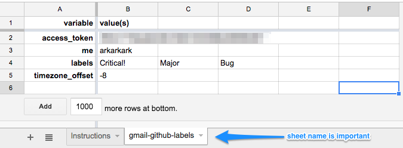

# gmail-github-labels

Make Gmail labels from Github issue labels and state.

When I'm reading about an issue in gmail, it's hard to tell if that
issue is assigned to me or I just got mentioned in it. I'd also like
to know if an issue is Critical or Major and considered a Bug. Those
are all specific labels we have come up with at our company.

This script fetches all the issues that have been modified since
yesterday, and also all the email about github issues and adds/removes
labels on the gmail thread to match the labels and state of the issue.

# Setup

Make a new Sheet in google docs (you can reuse the one you used for gmail-snooze if you want).
Make sure there is a sheet called `gmail-github-labels` (That's at the bottom, it might default to something like `Sheet1`). Set it up like this (you can probably cut and paste this table right into a sheet):

variable | value(s) |     |     |
-------- | -------- | --- | --- |
access_token | _blah-blah-blah_
me | _your_github_id_
labels | Critical! | Major | Bug
timezone_offset | -8
repositories | arkarkark/gmail-github-labels

   * `access_token` is made [here](https://github.com/settings/tokens/new) with `repo` scope.
   * `me` is your github handle (mine is arkarkark). This adds a `Mine` label to your issues.
   * `labels` is the github labels you are interested in. Gmail labels will be made for each of these.
   * `timezone_offset` allows us to work out when yesterday was.
   * `repositories` list all the respositories you're interested in tracking (it's optional.

Here's what it should look like:

Now click `Tools` and `Script editor...` from the menu and paste in [`gmail-github-labels.gs`](gmail-github-labels.gs) and save it.

From the `Run` menu select `setupGmailGithubLabels`

You can `View` -> `Logs` if you want to see what labels were created.

From the `Run` menu select `runGmailGithubLabels`

The first time you run the script it might take a while. `View` -> `Logs` will give you some insight into what's happening.

From the `Resources` menu select `Current project's triggers` and click `Add a new trigger` to call `runGmailGithubLabels`, `Time-driven` on a `Minutes timer` to run `Every 5 minutes`.

You're done! When a new issue is created or a label added to it, it _should_ show up in gmail within 5 minutes.
